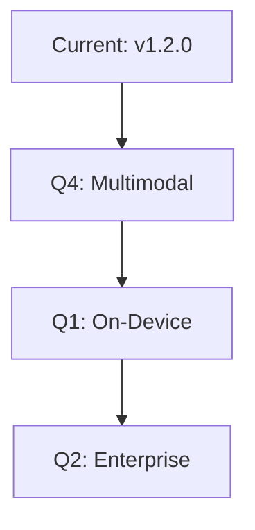

## Recent Updates

Stay informed about Warstellar's evolution. You receive new features that enhance AI-powered coding assistance, performance improvements for faster workflows, and critical bug fixes. Check the details below for each release.

<Callout kind="info">
  Subscribe to our RSS feed or join the Discord community to get notifications for new releases.
</Callout>

<Update label="2024-10-15" description="v1.2.0" tags={["feature", "improvement"]}>

## New Features

- Added real-time collaboration mode, allowing multiple developers to edit code simultaneously with AI suggestions.
- Introduced custom prompt templates for tailored code generation.

## Improvements

- Enhanced code completion speed by `>30%` through optimized model inference.
- Better integration with VS Code extensions for seamless workflow.

## Bug Fixes

- Fixed intermittent failures in multi-file project analysis.
- Resolved token limit errors during long-context processing.

```typescript
// Example: Using new collaboration API
import { WarstellarClient } from '@warstellar/sdk';

const client = new WarstellarClient({ apiKey: 'YOUR_API_KEY' });
await client.collaborate.startSession('project-id', { users: ['user1', 'user2'] });
```

</Update>

<Update label="2024-09-20" description="v1.1.0" tags={["feature", "bugfix"]}>

## New Features

- Launched advanced debugging assistant that auto-generates unit tests.
- Added support for Python 3.12 and Rust language models.

## Improvements

- Reduced latency in chat interface by optimizing WebSocket connections.

## Bug Fixes

- Patched security vulnerability in API key handling (CVE-2024-XXXX).
- Fixed autocomplete suggestions not respecting user-defined rules.

<CodeGroup tabs="TypeScript,Python">
```typescript
const client = new WarstellarClient({ apiKey: 'YOUR_API_KEY' });
const tests = await client.debug.generateTests('src/main.ts');
```
```python
from warstellar import Client
client = Client(api_key="YOUR_API_KEY")
tests = client.debug.generate_tests("main.py")
```
</CodeGroup>

</Update>

<Update label="2024-08-10" description="v1.0.0" tags={["breaking", "feature"]}>

## New Features

- Core AI coding assistant with natural language to code conversion.
- Integrated dashboard at `https://dashboard.warstellar.com` for project management.

## Breaking Changes

- Updated authentication to use JWT tokens instead of API keys only. Migrate by regenerating tokens.

## Bug Fixes

- Initial stability improvements for edge cases in code parsing.

</Update>

## Migration Guides

For breaking changes in recent releases, follow these steps to update your integration smoothly.

<Steps>
  <Step title="Update SDK" icon="download">

Install the latest version:

````bash
npm install @warstellar/sdk@latest
````

  </Step>
  <Step title="Regenerate Tokens" icon="key">

Visit `https://dashboard.warstellar.com/settings/tokens` and create new JWT tokens.

  </Step>
  <Step title="Update Code" icon="code">

Replace API key auth with token:

````typescript
// Old
const client = new WarstellarClient({ apiKey: 'old-key' });

// New
const client = new WarstellarClient({ token: 'YOUR_JWT_TOKEN' });
````

  </Step>
</Steps>

<Callout kind="alert">
  Test thoroughly in staging before deploying to production.
</Callout>

## Upcoming Roadmap

Get a glimpse of what's next for Warstellar.

<Columns cols={3}>
  <Card title="Q4 2024" icon="rocket" href="#">
    Multimodal AI support for images and diagrams in code gen.
  </Card>
  <Card title="Q1 2025" icon="zap" href="#">
    On-device inference for privacy-focused coding.
  </Card>
  <Card title="Q2 2025" icon="shield" href="#">
    Enterprise-grade compliance (SOC 2, GDPR enhancements).
  </Card>
</Columns>

<Expandable title="Detailed Roadmap" default-open="false">

Explore our public roadmap on GitHub for voting and feedback.


</Expandable>