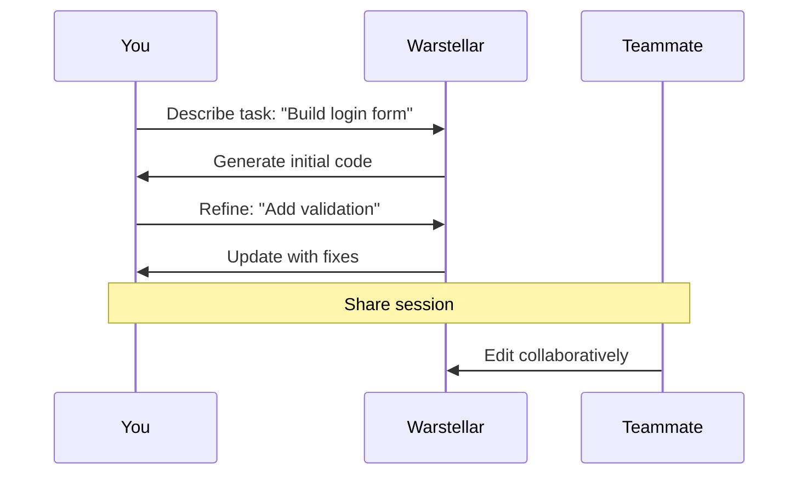

## Overview

Warstellar empowers you to code faster and smarter with AI-driven tools. You get intelligent suggestions, seamless debugging, collaborative workflows, and deep customization. These features integrate into your daily coding routine, boosting productivity without disrupting your flow.

<Columns cols={2}>
  <Card title="AI Code Completion" icon="zap" href="#ai-suggestions">
    Get context-aware suggestions as you type.
  </Card>
  <Card title="Integrated Debugging" icon="bug" href="#debugging">
    Resolve errors with AI assistance in real-time.
  </Card>
  <Card title="Collaboration Workflows" icon="users" href="#collaboration">
    Work with AI and teams simultaneously.
  </Card>
  <Card title="Customization" icon="settings" href="#customization">
    Tailor your environment to your needs.
  </Card>
</Columns>

## AI-Powered Code Suggestions and Autocompletion

Warstellar analyzes your codebase to provide precise code suggestions. As you type, it predicts completions, generates functions, and even refactors code on the fly. Accept suggestions with Tab or customize them via inline edits.

<Tabs>
  <Tab title="JavaScript" icon="code">
    Start typing a React component, and Warstellar completes it:

````javascript
function UserProfile({ user }) {
  return (
    <div className="profile">
      <h1>{`user.name`}</h1>  // AI suggests: user.name
      <p>{`user.email`}</p>   // AI autocompletes full prop access
    </div>
  );
}
````

    Press Tab to accept, or use Ctrl+Enter for multi-line generation.
  </Tab>
  <Tab title="Python" icon="code">
    In a data script, get function completions:

````python
import pandas as pd

def analyze_data(df):
    summary = df.`describe`()  # AI suggests: describe()
    return summary
````
  </Tab>
</Tabs>

<Callout kind="tip">
  Enable "Inline Suggestions" in settings for non-intrusive completions.
</Callout>

## Integrated Debugging and Error Resolution

Catch bugs before they slow you down. Warstellar highlights issues, suggests fixes, and runs diagnostics automatically. You hover over errors for one-click resolutions.

<Steps>
  <Step title="Detect Error" icon="alert-triangle">
    Write code with a potential issue. Warstellar underlines it immediately.
  </Step>
  <Step title="Apply Fix" icon="zap">
    Hover and select "Fix with AI". Review the diff before applying.
  </Step>
  <Step title="Test Inline" icon="play">
    Run tests directly in the editor to verify the resolution.
  </Step>
</Steps>

<CodeGroup tabs="JavaScript,Python">
```javascript
// Before: Error-prone loop
for (let i = 0; i < users.length; i++) {  // Warstellar flags off-by-one
  console.log(users[i + 1]);  // AI suggests: i
}

// After AI fix:
users.forEach(user => console.log(user));
```

```python
# Before: Index error
for i in range(len(data)):
    print(data[i + 1])  # Warstellar suggests bounds check

# After AI fix:
for item in data:
    print(item)
```
</CodeGroup>

## Human-AI Collaboration Workflows

Seamlessly blend your input with AI assistance. Start a task, let Warstellar propose solutions, then iterate together. Share sessions with teammates for live co-editing.



<Callout kind="info">
  Use `@ai` commands in comments to trigger specific AI actions, like `@ai refactor this function`.
</Callout>

## Customization Options

Tailor Warstellar to your workflow. Adjust AI models, themes, keybindings, and extensions.

<ExpandableGroup>
  <Expandable title="AI Model Selection" default-open="true">
    Switch between models for speed vs. accuracy:

    | Model       | Use Case              | Latency |
    |-------------|-----------------------|---------|
    | Fast        | Quick completions    | `<50ms` |
    | Advanced    | Complex refactoring  | `200ms` |
  </Expandable>
  <Expandable title="Theme and Keybindings">
    Import VS Code themes and remap keys via JSON config:

````json
{
  "theme": "dark-plus",
  "keybindings": {
    "acceptSuggestion": "tab"
  }
}
````
  </Expandable>
</ExpandableGroup>

<Columns cols={3}>
  <Card title="Next: Quickstart" icon="rocket" href="/quickstart">
    Set up Warstellar in 5 minutes.
  </Card>
  <Card title="Authentication" icon="lock" href="/authentication">
    Secure your sessions.
  </Card>
  <Card title="Changelog" icon="git-branch" href="/changelog">
    Latest updates.
  </Card>
</Columns>